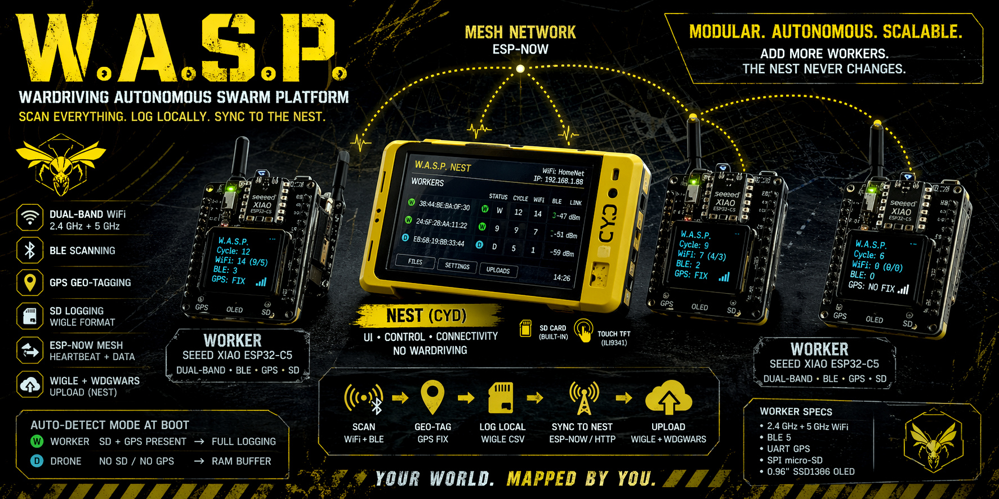

# W.A.S.P. — Wardriving Autonomous Swarm Platform



A from-scratch wardriving mesh built to learn how all the pieces fit together.

**W.A.S.P.** uses a **Nest / Worker** architecture:

- **Nest** (Cheap Yellow Display) — the base station. Purely UI, control, and connectivity. No wardriving. Manages worker status, handles file aggregation, and uploads to WiGLE and WDGWars when connected to a home network. Yellow. **All rich display work lives here.**
- **Worker** (Seeed XIAO ESP32-C5) — the autonomous scanner. Dual-band 2.4 GHz + 5 GHz WiFi and BLE. Carries its own GPS and SD card so it operates fully independently. Syncs back to the nest when in range. Black. **Status indicated by a single addressable RGB LED** — keeps power draw minimal for extended battery runs.

> Nest = yellow. Workers = black. Casings to follow.

---

## Worker vs Drone

Both run the same unified firmware (`stage8_unified/worker/worker.ino`). Mode is **auto-detected at boot** — no recompile needed.

| | Worker | Drone |
|---|---|---|
| SD card | Present | Absent |
| GPS | Present (used if detected) | Absent |
| Scan storage | WiGLE CSV on SD | 25-slot RAM circular buffer |
| Buffer capacity | Unbounded (SD) | 25 cycles × 40 WiFi + 20 BLE entries (~55 KB) |
| Buffer full behaviour | n/a | Oldest slot overwritten |
| Sync to nest | Raw TCP stream of `.csv` files (port 8080) | HTTP POST of serialised buffer slots |
| Coordinates | Real GPS fix (or NO FIX row) | 0.000000, 0.000000 |
| ESP-NOW heartbeat | Yes — `nodeType = 0x00` | Yes — `nodeType = 0x01` |
| Nest display label | Green dot · **W** | Cyan dot · **D** |

Detection order at boot:
1. `SD.begin()` — if it succeeds, Worker mode. If it fails, Drone mode.
2. GPS UART fed for 2 s — if `charsProcessed > 0`, GPS is live and used.

Both modes send an ESP-NOW heartbeat every 5 s and sync scan data to the nest every 25 cycles (configurable via `SYNC_EVERY`).

---

## Why this split?

The CYD's standard ESP32 is 2.4 GHz only — adding wardriving there would introduce a second-class scanner into the data. More importantly, one radio cannot cleanly handle ESP-NOW (listening for workers) + channel-hopping (wardriving) + WiFi STA (home network uploads) simultaneously. Keeping the nest off scanning duty eliminates that radio contention entirely and keeps the UI fully responsive.

The result is a clean separation:

```
WORKERS  — scan everything, log locally, push to nest
NEST     — display, control, receive, upload
```

Want more coverage? Add another worker. The nest never changes.

---

## Architecture

```
┌──────────────────────────────────────────────┐
│                NEST (CYD)                    │
│  Standard ESP32 — yellow                     │
│                                              │
│  ILI9341 touch display (built-in)            │
│  SD card (built-in)                          │
│                                              │
│  • Worker status dashboard                   │
│  • Receives scan data via ESP-NOW            │
│  • File browser and log management           │
│  • Connects to home WiFi for uploads         │
│  • WiGLE + WDGWars upload                    │
│  • No wardriving — radio free for comms      │
└────────────────┬─────────────────────────────┘
                 │  ESP-NOW (heartbeat / data)
                 │  WiFi AP/STA (file sync)
     ┌───────────┼───────────┐
     │           │           │
┌────┴────┐ ┌────┴────┐ ┌────┴────┐
│ WORKER  │ │ WORKER  │ │  DRONE  │
│ESP32-C5 │ │ESP32-C5 │ │ESP32-C5 │
│  black  │ │  black  │ │         │
│         │ │         │ │         │
│RGB LED  │ │RGB LED  │ │RGB LED  │
│GPS(UART)│ │GPS(UART)│ │RAM buf  │
│SD card  │ │SD card  │ │no SD/GPS│
│         │ │         │ │         │
│2.4G WiFi│ │2.4G WiFi│ │2.4G WiFi│
│5GHz WiFi│ │5GHz WiFi│ │5GHz WiFi│
│BLE      │ │BLE      │ │BLE      │
└─────────┘ └─────────┘ └─────────┘
```

---

## Hardware

| Role | Board | Colour | Notes |
|---|---|---|---|
| Nest | CYD JC2432W328C | Yellow | Built-in ILI9341 display, SD slot, touch |
| Worker | Seeed XIAO ESP32-C5 | Black | Dual-band (2.4 + 5 GHz) + BLE, RISC-V |

**All worker testing was done on the Seeed Studio XIAO Expansion Board v1.2** — the official carrier board for XIAO modules that provides a built-in OLED, SD card slot, Grove connectors, and clean breakouts for all XIAO pins without needing perfboard or loose wiring. This is the pre-perfboard stage of the build. If you are replicating this project, the XIAO Expansion Board removes a whole class of wiring problems and is strongly recommended for getting started.

The XIAO Expansion Board v1.2 exposes the following connections used by W.A.S.P.:

| Function | Expansion Board | XIAO pin | GPIO |
|---|---|---|---|
| GPS TX (module → C5) | GPS header | D7 | GPIO12 |
| GPS RX (C5 → module) | GPS header | D6 | GPIO11 |
| SD CS | SD header | D2 | GPIO25 |
| SD SCK | SD header | D8 | GPIO8 |
| SD MISO | SD header | D9 | GPIO9 |
| SD MOSI | SD header | D10 | GPIO10 |
| RGB LED data / R | D0 breakout | D0 | GPIO3 |
| RGB LED G | D4 breakout | D4 | GPIO23 |
| RGB LED B | D5 breakout | D5 | GPIO24 |

> **Note on the RGB LED:** Two types are supported, chosen via `ledType` in `worker.cfg`:
> - **`ws2812`** (default) — addressable WS2812B or SK6812 on D0 (GPIO3). SK6812 mini-e is recommended (3.3V tolerant). WS2812B works but prefers 5V logic — at short cable runs the C5's 3.3V output usually drives it.
> - **`rgb4pin`** — standard 4-pin common-cathode RGB LED. R=D0 (GPIO3), G=D4 (GPIO23), B=D5 (GPIO24). Pull each channel through a ~47–100Ω resistor to the GPIO pin; cathode to GND. D4 and D5 were freed in Stage 11 when the OLED was removed.
> Pull the LED's power from the 3V3 pin for battery efficiency.

**Peripherals per worker:**
- RGB LED — status flashes (GPS state, scan active, sync result). Type (`ws2812` or `rgb4pin`), brightness, and on/off controlled per-worker via `worker.cfg`. Replaces SSD1306 OLED — the Nest display handles all rich status; an OLED on a field unit nobody can read wastes power.
- UART GPS module — independent geo-tagging
- SPI micro-SD module — local log storage when out of nest range

**Nest peripherals:**
- SD card (built-in CYD slot) — aggregated log storage
- Onboard RGB LED (active LOW) — status flashes. Red: GPIO 4, Green: GPIO 16, Blue: GPIO 17. GPIO 4 is shared with `TFT_RST` in `User_Setup.h`; safe to use as an output after `tft.init()` completes.

> **Display driver:** The JC2432W328C runs an **ILI9341** panel — confirmed by working firmware. Some sources list ST7789; that applies to a different CYD variant. Configure `TFT_eSPI`'s `User_Setup.h` with `#define ILI9341_DRIVER`.

---

## LED Status Flash Codes

### Worker (D0/GPIO3 for WS2812B; D0+D4+D5 for 4-pin common-cathode)

| State | Colour | Pattern |
|---|---|---|
| Boot / power-on | White | 3× quick flash (50 ms each) |
| GPS acquiring | Amber `#FAA307` | Slow pulse — 800 ms on / 800 ms off |
| GPS fix acquired | Cyan `#00FFFF` | 2× flash |
| Scan cycle start | Yellow `#FFFF00` | 1× flash (100 ms) |
| Connecting to Nest AP | Blue `#4488FF` | Fast blink (200 ms) |
| Sync success | Green `#00FF00` | 2× flash |
| Sync fail / nest unreachable | Red `#FF0000` | 3× fast flash |
| Chunked upload failed (file → .defer) | Orange `#FF6600` | 4× fast flash |
| Low heap warning | Red `#FF0000` | 1× slow pulse (400 ms) |

LED type, brightness, and on/off are set per-worker in `/worker.cfg` on the worker SD card. See `worker.cfg.example`.

### Nest (onboard RGB LED — active LOW, GPIOs 4 / 16 / 17)

| State | Colour | Pattern |
|---|---|---|
| Boot / power-on | White (R+G+B) | 3× quick flash (50 ms each) |
| Worker heartbeat received | Green | 1× brief flash (50 ms) |
| File chunk / sync received | Blue | 1× flash (80 ms) per chunk |

> GPIO 4 (red channel) is shared with `TFT_RST` in `TFT_eSPI`'s `User_Setup.h`. It is reclaimed as a plain output immediately after `tft.init()` completes — the reset pulse only fires once at startup.

---

## Build Stages

| Stage | Description | Status |
|---|---|---|
| 1 | ESP-NOW ping-pong — prove cross-chip comms (Nest ↔ Worker) | ✅ Complete |
| 2 | Worker standalone scan — 2.4 + 5 GHz WiFi + BLE to serial | ✅ Complete |
| 3 | Worker with GPS — geo-tagged scans to serial | ✅ Complete |
| 4 | Worker with SD — write WiGLE-format log locally | ✅ Complete |
| 5 | Real-time streaming — worker streams scan data to nest via ESP-NOW | ✅ Complete |
| 6 | File sync — worker connects to nest AP and transfers logs | ✅ Complete |
| 7 | Nest display — worker list, scan counts, file browser on CYD touch | ✅ Complete |
| 8 | Unified worker firmware — auto-detects Worker vs Drone mode at boot | ✅ Complete |
| 9 | Hardened file sync — 8 KB log cap, RAM pre-buffer, path validation, TCP upload | ✅ Complete |
| 10 | Chunked upload — split large files into 8 KB chunks for reliable transfer of any size | ✅ Complete |
| 11 | RGB LED status — replace OLED with single addressable LED; brightness + on/off in worker.cfg | ✅ Complete |
| 12 | Home upload — Nest connects to home WiFi and uploads CSVs to WiGLE + WDGWars; worker `ledType` config (ws2812 / rgb4pin) | ✅ Complete |

---

## Getting Started

### Arduino IDE Setup

**Board package:** `esp32 by Espressif Systems` v3.0.0 or newer.
Install via `Tools > Board > Board Manager`.

| Device | Board selection |
|---|---|
| Nest (CYD) | `ESP32 Dev Module` |
| Worker (C5) | `XIAO_ESP32C5` |

> **Important for Worker — three settings required before flashing:**
> - `Tools > USB CDC On Boot > Enabled` — the C5 uses native USB, without this Serial output will not appear
> - `Tools > Partition Scheme > Huge APP (3MB No OTA/1MB SPIFFS)` — the default partition scheme only allocates ~1.25MB for the app; NimBLE needs ~1.35MB, so this is required (4MB flash is fine)
> - `Tools > PSRAM > Disabled` — the XIAO ESP32-C5 has no physical PSRAM; enabling it causes a boot crash (`Failed to allocate dummy cacheline for PSRAM memory barrier!`)

### Required Libraries

| Library | Install via |
|---|---|
| NimBLE-Arduino by h2zero | Tools > Manage Libraries |
| TinyGPS++ by Mikal Hart | Tools > Manage Libraries |
| Adafruit NeoPixel by Adafruit | Tools > Manage Libraries |

### Config Files

Both devices use a simple `key=value` config file on their own SD card. Lines starting with `#` are comments; no spaces around `=`.

**Nest — `/wasp.cfg`** (see `wasp.cfg.example`)

| Key | Default | Description |
|---|---|---|
| `homeSsid` | — | Home Wi-Fi SSID for WiGLE / WDGWars uploads |
| `homePsk` | — | Home Wi-Fi password |
| `apSsid` | `WASP-Nest` | Nest AP name that workers connect to for file sync |
| `apPsk` | `waspswarm` | Nest AP password |
| `wigleBasicToken` | — | WiGLE 'Encoded for use' API token |
| `wdgwarsApiKey` | — | WDGWars API key (64 hex chars) |

**Worker — `/worker.cfg`** (see `worker.cfg.example`)

| Key | Default | Description |
|---|---|---|
| `ledEnabled` | `true` | `false` or `0` to disable all LED output |
| `ledBrightness` | `40` | 0–255 brightness (40 ≈ 15%, visible but not blinding) |
| `ledType` | `ws2812` | `ws2812` = addressable WS2812B/SK6812 on D0; `rgb4pin` = common-cathode 4-pin RGB (R=D0, G=D4, B=D5) |

Config is read once at boot. If the file is absent, compiled-in defaults apply.
Each worker can carry its own `worker.cfg` so units can be tuned independently without reflashing.

---

### Stage 1 — ESP-NOW Ping-Pong

Located in `stage1_espnow_pingpong/`.

Flash `nest/nest.ino` to the CYD and `worker/worker.ino` to the C5.
Bring them within range. Both serial monitors should show traffic:

```
[NEST] TX PING #0 ... sent
[NEST] RX PONG #0 from 38:44:BE:BA:0F:30 | RSSI -35 dBm
```
```
[WORKER] RX PING #0 from A4:F0:0F:5D:96:D4 | RSSI -34 dBm
[WORKER] TX PONG #0 ... sent
```

### Stage 3 — Worker with GPS

Located in `stage3_worker_gps/`.

**GPS wiring (per worker):**

| GPS pin | C5 pin | Notes |
|---|---|---|
| TX | D7 (GPIO12) | C5 UART1 RX |
| RX | D6 (GPIO11) | C5 UART1 TX — only needed to configure module |
| VCC | 3V3 | |
| GND | GND | |

Flash `worker/worker.ino` to the C5. Expected output at the top of each cycle:

```
========================================
[WORKER] GPS  39.108890, -76.771390 | alt 46.0m | sats 8 | hdop 1.20
```

Or before a fix is acquired:

```
[WORKER] GPS  NO FIX (sats seen: 3) — scan data has no coordinates
```

The GPS coordinates printed at the start of each cycle apply to all networks found in that cycle. Cold-start fix time is typically 30–90 seconds outdoors with clear sky.

---

### Stage 2 — Worker Standalone Scan

Located in `stage2_worker_scan/`.

Flash `worker/worker.ino` to the C5. The worker scans all WiFi channels
(2.4 + 5 GHz) and BLE, printing results each cycle:

```
[WORKER] Starting WiFi scan (2.4 GHz + 5 GHz)...
  #    Band  Ch   RSSI  Security        BSSID              SSID
    1  2.4G   6   -42   WPA2_PSK        AA:BB:CC:DD:EE:FF  HomeNet
    2  5GHz  36   -61   WPA2/WPA3       11:22:33:44:55:66  HomeNet_5G
[WORKER] WiFi: 2 network(s) — 1 x 2.4GHz, 1 x 5GHz

[WORKER] Starting BLE scan (3000 ms)...
  RSSI  -55   38:44:BE:BA:01:23      MyPhone
```

### Stage 5 — ESP-NOW Streaming

Located in `stage5_espnow_streaming/`.

Flash `worker/worker.ino` to the C5 and `nest/nest.ino` to the CYD.
The worker continues logging to SD as in Stage 4 and additionally sends a
packed summary to the nest after every scan cycle. The nest serial monitor
shows live updates from each worker:

```
[NEST] Worker 38:44:BE:BA:0F:30 | cycle 1 | RSSI link -47 dBm
       GPS FIX  39.108890, -76.771390 | alt 46.0m | sats 10 | hdop 1.20
       WiFi: 14 total (9 x 2.4G, 5 x 5G) best -41 dBm
       BLE:  3 device(s)

[NEST] Worker 38:44:BE:BA:0F:30 | cycle 2 | RSSI link -35 dBm
       GPS FIX  51.899550, -2.124360 | alt 52.0m | sats 9 | hdop 1.40
       WiFi: 11 total (7 x 2.4G, 4 x 5G) best -38 dBm
       BLE:  2 device(s)

[NEST] Worker 38:44:BE:BA:0F:30 | cycle 3 | RSSI link -51 dBm
       GPS FIX  45.437400, -75.613900 | alt 64.0m | sats 11 | hdop 1.10
       WiFi: 9 total (6 x 2.4G, 3 x 5G) best -45 dBm
       BLE:  4 device(s)

[NEST] Worker 38:44:BE:BA:0F:30 | cycle 4 | RSSI link -44 dBm
       GPS FIX  -35.297500, 149.151600 | alt 580.0m | sats 8 | hdop 1.60
       WiFi: 7 total (5 x 2.4G, 2 x 5G) best -55 dBm
       BLE:  1 device(s)

[NEST] Worker 38:44:BE:BA:0F:30 | cycle 5 | RSSI link -39 dBm
       GPS FIX  -41.276800, 174.779400 | alt 12.0m | sats 10 | hdop 1.30
       WiFi: 6 total (4 x 2.4G, 2 x 5G) best -49 dBm
       BLE:  2 device(s)

[NEST] Worker 38:44:BE:BA:0F:30 | cycle 6 | RSSI link -42 dBm
       GPS FIX  31.311260, 34.542690 | alt 118.0m | sats 9 | hdop 1.50
       WiFi: 0 total (0 x 2.4G, 0 x 5G) best 0 dBm
       BLE:  0 device(s)
```

The `RSSI link` value is the signal strength the nest sees for the ESP-NOW
packet — useful for understanding worker range.

---

## Repository Layout

```
/
├── stage12_home_upload/           ← active firmware (flash this)
│   ├── nest/
│   │   ├── nest.ino               ← CYD: display + AP + chunked upload + WiGLE/WDGWars
│   │   └── nest_types.h
│   └── worker/worker.ino          ← C5: unified Worker/Drone + RGB LED status
│
└── learned/                       ← reference copies of all prior stages
    ├── stage1_espnow_pingpong/
    │   ├── nest/nest.ino
    │   └── worker/worker.ino
    ├── stage2_worker_scan/
    │   ├── nest/nest.ino          ← unchanged from stage 1
    │   └── worker/worker.ino
    ├── stage3_worker_gps/
    │   ├── nest/nest.ino          ← unchanged from stage 1
    │   └── worker/worker.ino
    ├── stage4_worker_sd/
    │   ├── nest/nest.ino          ← unchanged from stage 1
    │   └── worker/worker.ino
    ├── stage5_espnow_streaming/
    │   ├── nest/nest.ino
    │   └── worker/worker.ino
    ├── stage6_file_sync/
    │   ├── nest/nest.ino
    │   └── worker/worker.ino
    ├── stage7_nest_display/
    │   ├── nest/nest.ino
    │   └── worker/worker.ino     ← unchanged from stage 6
    └── stage8_unified/
        ├── nest/nest.ino         ← unchanged from stage 7
        └── worker/worker.ino
```

---

## Credits

W.A.S.P. is built from scratch as a learning exercise, developed with
[Claude Code](https://claude.ai/code) by Anthropic.

- WiGLE: [wigle.net](https://wigle.net)
- WDGWars: [wdgwars.pl](https://wdgwars.pl)

**Inspiration:**
- [JustCallMeKoko](https://github.com/justcallmekoko) — ESP32 wardriving pioneer whose work in the space inspired this project
- [SpicedHam](https://github.com/SpicedHam) — wardriving community inspiration
